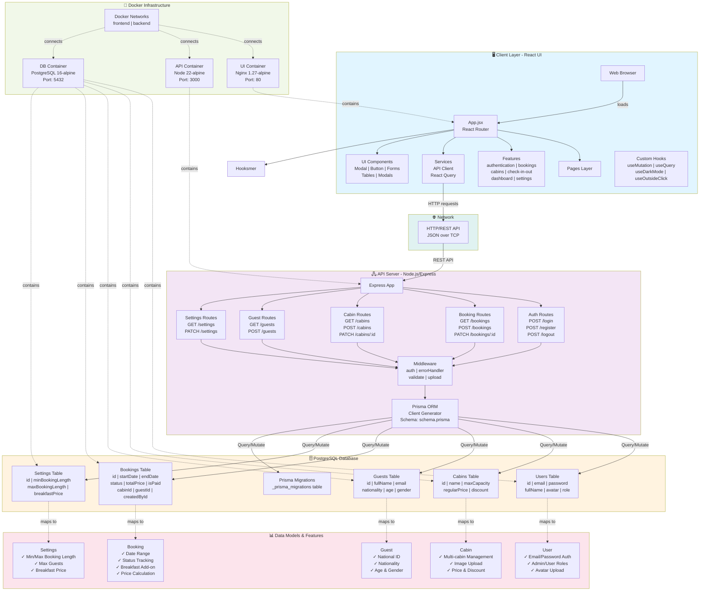
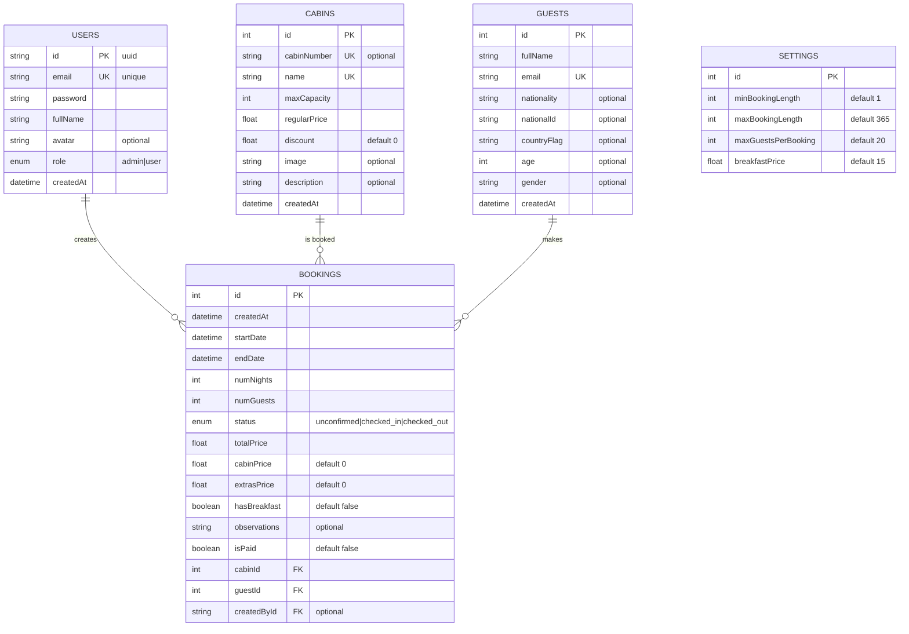
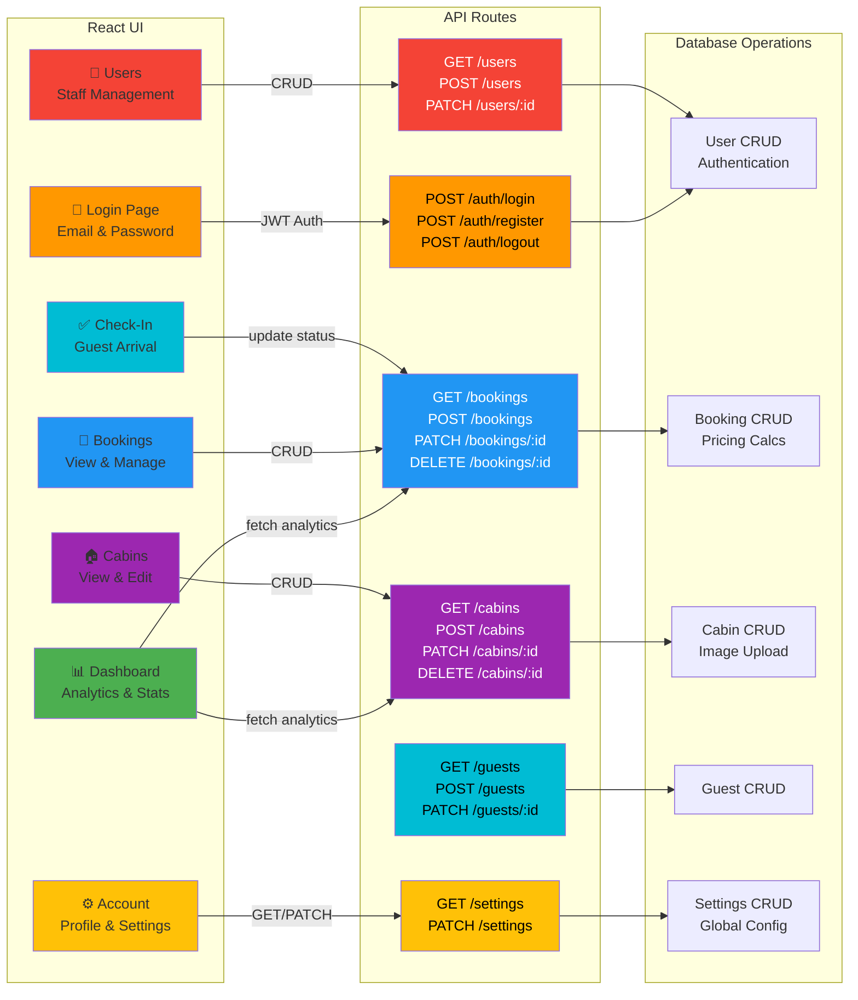

# The Wild Oasis 🏨

A modern, full-stack hotel management system built with cutting-edge web technologies. Manage cabins, bookings, guests, and check-ins/check-outs with an intuitive interface and robust backend API.

## 📋 Table of Contents

- [Overview](#overview)
- [Tech Stack](#tech-stack)
- [Project Structure](#project-structure)
- [Prerequisites](#prerequisites)
- [Quick Start](#quick-start)
- [Environment Setup](#environment-setup)
- [Available Commands](#available-commands)
- [Architecture](#architecture)
- [Docker Deployment](#docker-deployment)
- [Contributing](#contributing)
- [License](#license)

## Overview

The Wild Oasis is a comprehensive hotel management platform designed for managing hospitality operations. It provides:

- **Cabin Management**: List, create, update, and manage cabin inventory
- **Booking System**: Track reservations with detailed guest information
- **Check-in/Check-out**: Streamline arrival and departure processes
- **Dashboard**: Real-time analytics and overview of operations
- **Settings**: Configure system preferences and user accounts
- **User Authentication**: Secure login with JWT-based authentication
- **Dark Mode**: Light and dark theme support

## Tech Stack

### Frontend (UI)

- **Framework**: React 18.3
- **Build Tool**: Vite 5.3
- **Styling**: Styled Components
- **State Management**: React Query (TanStack Query)
- **Form Management**: React Hook Form
- **Routing**: React Router v6
- **Testing**: Jest, React Testing Library
- **Charts**: Recharts
- **UI Components**: React Icons
- **Notifications**: React Hot Toast
- **Date Handling**: date-fns

### Backend (API)

- **Runtime**: Node.js with TypeScript
- **Framework**: Express.js
- **Database**: PostgreSQL with Prisma ORM
- **Authentication**: JWT (JSON Web Tokens)
- **Password Hashing**: bcryptjs
- **Validation**: Zod
- **API Documentation**: Swagger/OpenAPI
- **Security**: Helmet, CORS, Rate Limiting
- **File Upload**: Multer
- **Image Processing**: Sharp
- **Logging**: Morgan

### DevOps

- **Containerization**: Docker & Docker Compose
- **Process Management**: PM2 (for production)
- **Code Quality**: ESLint, Prettier
- **Git Hooks**: Husky, Lint-staged

## Project Structure

```
the-wild-oasis/
├── ui/                          # React frontend application
│   ├── src/
│   │   ├── features/            # Feature modules
│   │   ├── pages/               # Page components
│   │   ├── components/          # Reusable components
│   │   ├── hooks/               # Custom React hooks
│   │   ├── services/            # API services
│   │   ├── utils/               # Utility functions
│   │   └── styles/              # Global styles
│   ├── jest.config.js           # Jest configuration
│   ├── vite.config.js           # Vite configuration
│   └── package.json
│
├── api/                         # Node.js backend application
│   ├── src/
│   │   ├── config/              # Configuration files
│   │   ├── controllers/         # Route controllers
│   │   ├── middleware/          # Express middleware
│   │   ├── routes/              # API routes
│   │   ├── schemas/             # Zod validation schemas
│   │   ├── utils/               # Utility functions
│   │   ├── app.ts               # Express app setup
│   │   └── server.ts            # Server entry point
│   ├── prisma/
│   │   ├── schema.prisma        # Database schema
│   │   ├── migrations/          # Database migrations
│   │   └── seed.ts              # Database seeding
│   ├── jest.config.js           # Jest configuration
│   ├── tsconfig.json            # TypeScript configuration
│   └── package.json
│
├── docker-compose.yaml          # Docker Compose configuration
├── env.example                  # Environment variables template
└── README.md                    # This file
```

## Prerequisites

- **Node.js**: v18 or higher
- **npm** or **yarn**: Package managers
- **Docker**: For containerized development (optional but recommended)
- **PostgreSQL**: v14 or higher (or use Docker)
- **Git**: Version control

## Quick Start

### Option 1: Docker Compose (Recommended)

```bash
# Clone the repository
git clone <repository-url>
cd the-wild-oasis

# Copy and configure environment variables
cp env.example .env

# Start all services with Docker Compose
docker compose up --build

# The application will be available at:
# - UI: http://localhost
# - API: http://localhost:3000
# - Database: PostgreSQL on port 5432
```

### Option 2: Manual Setup

**1. Set up the database:**

```bash
# Ensure PostgreSQL is running
# Update .env with your PostgreSQL credentials
cp env.example .env
```

**2. Set up the API:**

```bash
cd api

# Install dependencies
yarn install

# Generate Prisma client
yarn prisma:generate

# Run database migrations
yarn prisma:migrate

# (Optional) Seed the database with sample data
yarn prisma:seed

# Start development server
yarn dev

# API will be available at http://localhost:3000
```

**3. Set up the UI:**

```bash
cd ui

# Install dependencies
yarn

# Update VITE_API_URL in .env if needed
# Start development server
yarn dev

# UI will be available at http://localhost:5173
```

## Environment Setup

Copy `env.example` to `.env` and configure the following variables:

### Database

```
POSTGRES_USER=postgres
POSTGRES_PASSWORD=your_secure_password
POSTGRES_DB=wild_oasis
```

### API

```
API_PORT=3000
JWT_SECRET=your_jwt_secret_key
JWT_EXPIRES_IN=1d
JWT_REFRESH_SECRET=your_refresh_secret_key
JWT_REFRESH_EXPIRES_IN=7d
CORS_ORIGINS=http://localhost,http://localhost:3000
MAX_FILE_SIZE_MB=5
```

### UI

```
UI_PORT=80
VITE_API_ORIGIN=http://localhost:3000
VITE_API_URL=http://localhost:3000/api/v1
```

## Available Commands

### UI Commands

```bash
cd ui

# Development
yarn dev                    # Start Vite dev server
yarn build                  # Build for production
yarn preview                # Preview production build

# Testing
yarn test                   # Run Jest tests
yarn test:watch             # Run tests in watch mode
yarn test:coverage          # Generate coverage report

# Code Quality
yarn lint                   # Lint code
yarn lint:fix               # Fix linting issues
yarn prettier               # Check code formatting
yarn prettier:write         # Format code
```

### API Commands

```bash
cd api

# Development
yarn dev                    # Start TypeScript dev server
yarn build                  # Build TypeScript
yarn start                  # Start production server

# Testing
yarn test                   # Run Jest tests
yarn test:watch             # Run tests in watch mode
yarn test:coverage          # Generate coverage report

# Database
yarn prisma:generate        # Generate Prisma client
yarn prisma:migrate         # Run pending migrations
yarn prisma:deploy          # Deploy migrations (production)
yarn prisma:studio          # Open Prisma Studio GUI
yarn prisma:seed            # Seed database with sample data
yarn db:seed:pg             # Seed with PostgreSQL script

# Code Quality
yarn lint                   # Lint code
yarn lint:fix               # Fix linting issues
yarn prettier               # Check code formatting
yarn prettier:write         # Format code
```

### Root Commands

```bash
# Docker operations (from project root)
docker compose up           # Start all services
docker compose up --build   # Build and start services
docker compose down         # Stop all services
docker compose logs -f      # Follow logs
```

## Architecture

### Frontend Architecture

The UI follows a modular feature-based architecture:

- **Features**: Self-contained modules (e.g., authentication, bookings)
- **Custom Hooks**: Reusable logic (`useDarkMode`, `useLocalStorageState`, etc.)
- **Services**: API communication layer
- **Utils**: Helper functions
- **Responsive Design**: Mobile-first approach using Styled Components

### Backend Architecture

The API follows a layered architecture:

- **Routes**: HTTP endpoint definitions
- **Controllers**: Request handlers and business logic
- **Middleware**: Request processing (auth, validation, error handling)
- **Schemas**: Zod validation schemas
- **Database**: Prisma ORM with PostgreSQL
- **RESTful Design**: Standard HTTP methods and status codes

### Database Schema

Key entities:

- **Users**: System user accounts with roles
- **Cabins**: Room inventory with pricing
- **Guests**: External guest information
- **Bookings**: Reservation records
- **Settings**: System configuration

### System Architecture Diagram



### Database Entity Relationship Diagram



### User Interaction & API Flow



## Docker Deployment

### Building Images

```bash
# Build specific service
docker compose build api
docker compose build ui

# Build all services
docker compose build
```

### Running Containers

```bash
# Run detached
docker compose up -d

# View logs
docker compose logs -f api
docker compose logs -f ui

# Execute commands in container
docker compose exec api yarn prisma:migrate
docker compose exec api yarn test
```

## Contributing

### Development Workflow

1. Create a feature branch: `git checkout -b feature/feature-name`
2. Make your changes and commit: `git commit -m "Add feature"`
3. Push to branch: `git push origin feature/feature-name`
4. Open a pull request

### Code Standards

- Follow ESLint and Prettier configurations
- Write unit tests for new features
- Maintain TypeScript type safety
- Document complex logic
- Use conventional commit messages

### Testing Requirements

- Unit tests for utilities and business logic
- Integration tests for API routes
- Component tests for UI components
- Aim for 80%+ code coverage

## Security Considerations

- ✅ JWT-based authentication
- ✅ Password hashing with bcryptjs
- ✅ CORS protection
- ✅ Rate limiting on API endpoints
- ✅ Helmet security headers
- ✅ Input validation with Zod
- ✅ Environment variable isolation
- ⚠️ Always use strong JWT secrets in production
- ⚠️ Enable HTTPS in production
- ⚠️ Keep dependencies updated

## Performance Tips

- **Frontend**:
  - Enable code splitting in Vite
  - Use React Query for efficient data fetching
  - Lazy load route components
  - Optimize images with Sharp

- **Backend**:
  - Use database indexes on frequently queried columns
  - Implement caching strategies
  - Use connection pooling
  - Monitor API response times

## Troubleshooting

### Database Connection Issues

```bash
# Check PostgreSQL is running
docker compose ps

# View database logs
docker compose logs postgres

# Manually run migrations
docker compose exec api yarn prisma:migrate dev
```

### Port Already in Use

```bash
# Change ports in docker-compose.yaml or .env
# Ensure no other services are using ports 80, 3000, 5432
```

### Tests Failing

```bash
# Clear jest cache
yarn test --clearCache

# Reinstall dependencies
rm -rf node_modules yarn.lock
yarn install
```

## Additional Resources

- [React Documentation](https://react.dev)
- [Express.js Guide](https://expressjs.com)
- [Prisma Documentation](https://www.prisma.io/docs)
- [PostgreSQL Documentation](https://www.postgresql.org/docs)
- [Docker Documentation](https://docs.docker.com)
- [TypeScript Handbook](https://www.typescriptlang.org/docs)

## License

MIT License - See LICENSE file for details

---

**Last Updated**: March 2026  
**Version**: 1.0.0  
**Maintained By**: Development Team
